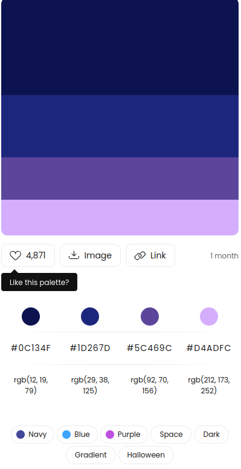

# ft transcendece

## rules:
to work on this team and all the working goes smoothely there is some rules you have to follow:
 - for each feature you have to create new brance and the name of the branch will describe the feature you want to add
 - do not ever under any circumstance change directly on the master branch
 - do not use git add . or * , instead add only the files that you have changed
 - each commit must only contain one change, and the commit message must be descriptive
 - for each feature you have to make a pull request that will be reviewd and merged by otossa
 - do not add any irrelevent files (include them in the git ignore instead)
 - you must write small function that do one thing 
 - do not repeat your self
 - all the variables related to the configuration or secret keys and tokens will be stored on .env file
 - all .env file must be encluded on .gitignore so they will not be staged
### naming convention:
 - variables must be camel case and must describe what it used to store
 - methods must be camel case and must describe what it do
 - classes must be in pascal case
 - for html classes and id's must be in cabab case

## stack:
this broject will be written in this stack: 
    - nestjs for the backend
    - vuejs for the front end (vuetify as component library, pinia as state management system)
    - nginx to serve the application
    - postgres as DBMS 
    - docker , all this will be dockerized, 
        -   for development there will be docker-compose-dev.yml that will run the project on the watch mode
        -   for production there will be docker-compose.yml that will build the project for production
## colors:



`primary color: #0C134F`
## run:

to run the project for dev on the watch mode run the command on the project root direcotry:

```bash
    docker compose up -f docker-compose-dev.yml
```


## db tables:

users:
    - id (uuid)
    - username (intra login editable)
    - avatar (path to image can be uploaded, intra image initially)
    - fullname
    - password ()

messages:
    - id 
    - user_id
    - conversation_id
    - content

conversations:
    - id

conversation_users:
    - id
    - conversation_id
    - user_id

rooms:
    - id
    - name
    - type (public|protected|private)
    - password (if protected by a password)
    - owner

room_users:
    - id
    - room_id
    - user_id
    - role

room_messages:
    - id
    - room_id
    - user_id
    - content


### game:

games:
    - id 
    - host_id (first user in the lobby)
    - get_id (second user)
    - status (finished | live)
    - winner_id (if finished id of the user that wins)
test hooks


--------------------------
data will be expected on user profile
```typescript

type Game = {
  id: string
  winner: User
  guest: User
  host: user
}

type UserGame = {
 game: Game
 score: int
 opponentScore: int
 opponent: User
}

type user = {
 id: string
 username: string
 avatar: string
 email: string
 games: Usergame
 level: Level
 leag: Leag
 globalRank: Rank[]
 localRank: Rank[]
 }

 type Leag = {
   id: string
   maxPoits: int
   image: string
}
 type Level = {
  user: User
  points: int
  }

 type Rank = {
   userId: string
   usename: string
   points: int
   rank: int
   leagName: string
}


type Acheivments = {
 id: int
 name: string
 }

```

deploy try 2
